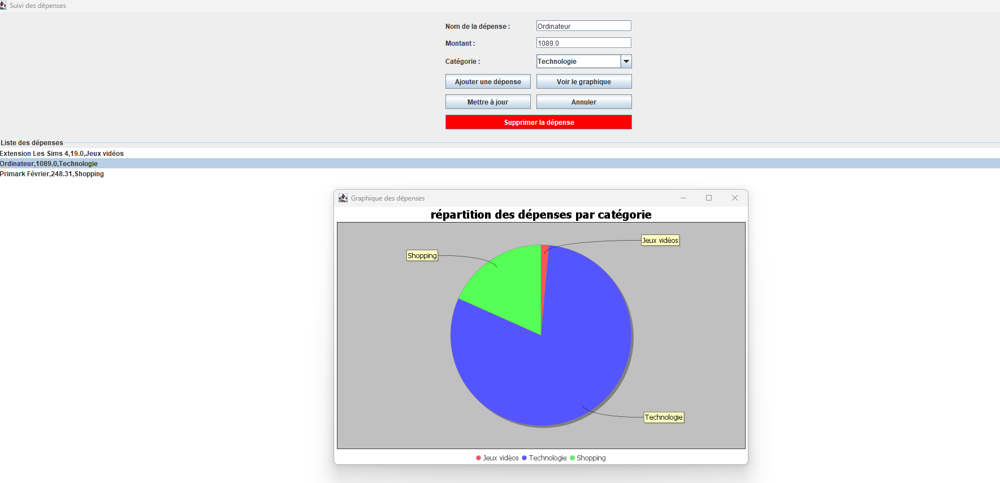

# Suivi des Dépenses

## Description
Ce projet permet de suivre les dépenses et de gérer un budget personnel facilement.

## Aperçu de l'application
Voici une capture d'écran de l'interface de gestion des dépenses.

## Fonctionnalités
- Suivi des dépenses
- Gestion des catégories
- Analyse de l'historique des dépenses
- Pouvoir modifier une dépense individuellement même si deux portent le même nom (index)

