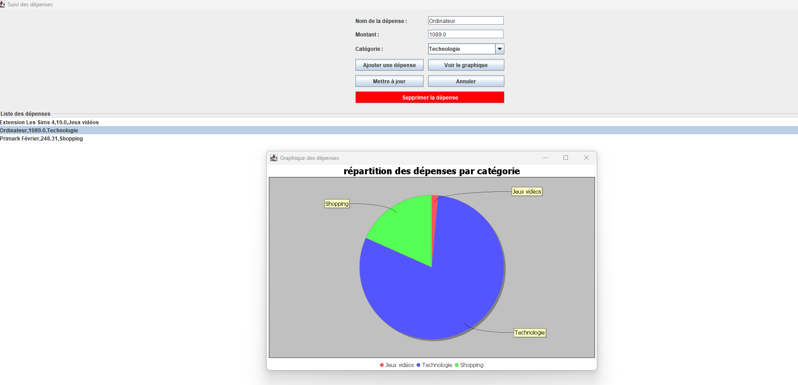

# Suivi des Dépenses

## Description
Ce projet permet de suivre les dépenses et de gérer un budget personnel facilement.

## Aperçu de l'application
Voici une capture d'écran de l'interface de gestion des dépenses.  
L'analyse graphique présente la répartition des dépenses par catégorie. Une dépense est également sélectionnée pour démonstration.

## Fonctionnalités
- Suivi des dépenses au quotidien
- Gestion des catégories
- Analyse de l'historique via graphique (camembert)
- Modification individuelle d’une dépense, même si plusieurs portent le même nom (via un index)

## Fonctionnalités à développer
- Intégrer un système de date pour les dépenses
- Comparaison de périodes (mois, année, etc.)
- Ajout d’une alerte ou limite de budget personnalisable

## Défis rencontrés
- La suppression initiale se faisait par nom : si deux dépenses avaient le même nom, les deux étaient supprimées. → Passage à une gestion par index unique.
- Implémentation et compréhension du Pie Chart pour un affichage clair et visuel des données.

## Technologies utilisées

  
  
  

